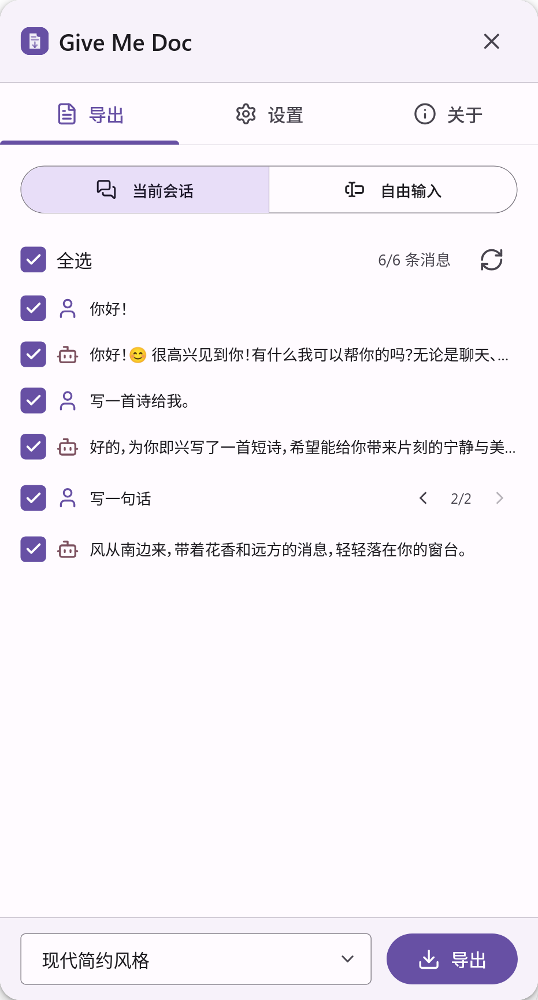
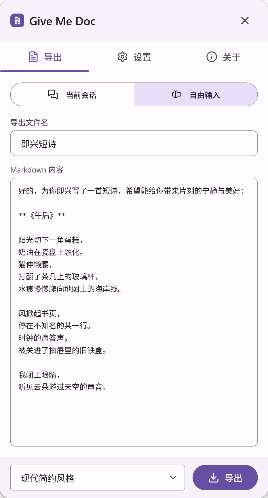
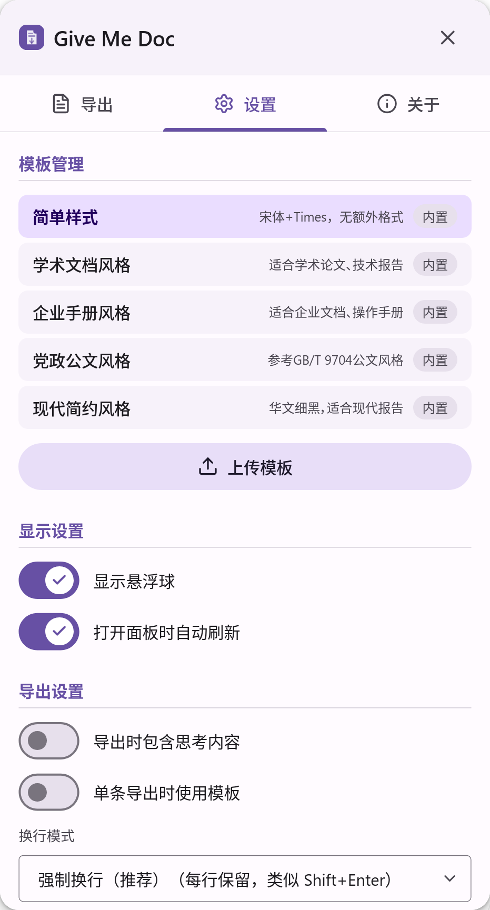

<div align='center'>
  
  <h1>GiveMeDoc</h1>
  <a href="README.md">中文</a>
</div>
<br/>
<div align='center'>An AI conversation-to-Word export tool based on <b><em>⚡️Pandoc WASM⚡️</em></b></div>
<div align='center'><b>🚫 Stop paying to export your conversations to Word</b></div>
<br/>

|  |  |  |
| ----- | ---- | ---- |

## 🤔 Why GiveMeDoc?

I've had enough of those garbage plugins that just wrap Pandoc in a paywall, and dare to charge subscription fees. GiveMeDoc is here to break the mold and provide a truly free, open-source solution for exporting your AI conversations without any hidden costs.

- **Free forever**: No paywalls, no subscriptions, no hidden costs.
- **No backend**: Pure client-side Pandoc WASM conversion. All processing happens in your browser; no data is ever sent to any server.
- **Fully open source**: AGPL-3.0 licensed.

## ⚡️ Features

- **Pandoc WASM**: Pandoc runs entirely in your browser via WebAssembly. No server, no network, true offline capability.
- **Native OMML Formulas**: No more screenshot formulas. LaTeX math in AI responses is exported as Word-native OMML equations — editable, searchable, and crisp at any zoom level.
- **Multiple Built-in Templates**: Choose from Academic, Modern, Minimal, Manual, and more. Upload your own `.docx` reference templates for full customization.
- **Branch-Aware Export**: Navigate and export specific conversation branches. Cherry-pick individual messages or export the entire conversation tree.
- **Free-text Mode**: Don't see your platform supported yet? Simply copy-paste any Markdown into the free-text input and convert it to a polished `.docx` instantly.
- **Thinking Content Toggle**: Include or exclude the model's chain-of-thought / thinking process in your export.
- **Material 3 Inspired UI**: A clean, modern floating panel that stays out of your way.

## 🌐 Supported Platforms

| Platform | Status | Method |
|----------|--------|--------|
| **DeepSeek** | ✅ Native adapter | Automatic session capture via API / IndexedDB |
| **ChatGPT, Claude, Gemini, etc.** | ✅ Via free-text | Copy-paste Markdown into free-text mode |
| *More adapters coming soon* | 🚧 | PRs welcome! |

## 🚀 Getting Started

GiveMeDoc is available as both a **browser extension** (Chrome / Edge / Firefox) and a **Tampermonkey userscript**. It is not yet published to any extension store — please install manually for now.

### Option 1: Browser Extension (Chrome / Edge / Firefox) (Recommended)

- **Chrome / Edge**:
  1. Download the latest extension package: [Click here to download](https://github.com/Qalxry/GiveMeDoc/releases/latest/download/give-me-doc_chrome.zip)
  2. Unzip the downloaded `give-me-doc_chrome.zip` file into a `give-me-doc_chrome` folder.
  3. Go to `chrome://extensions` in your browser (Edge users: `edge://extensions`).
  4. Enable `Developer mode` in the top-right corner, click `Load unpacked`, and select the `give-me-doc_chrome` folder.
  5. Click the GiveMeDoc icon in the browser toolbar, or use the in-page floating button on supported sites.

- **Firefox**:
  1. Download the latest extension package: [Click here to download](https://github.com/Qalxry/GiveMeDoc/releases/latest/download/give-me-doc_firefox.zip)
  2. Go to `about:debugging#/runtime/this-firefox` in your browser.
  3. Click `Load Temporary Add-on` and select the downloaded `give-me-doc_firefox.zip` file.
  4. Click the GiveMeDoc icon in the browser toolbar, or use the in-page floating button on supported sites.

### Option 2: Tampermonkey Userscript

1. Install [Tampermonkey](https://www.tampermonkey.net/) in your browser.
2. [Click here to install](https://github.com/Qalxry/GiveMeDoc/releases/latest/download/give-me-doc.user.js) the latest userscript.
3. Visit [chat.deepseek.com](https://chat.deepseek.com) — a floating action button will appear.

## 🔨 Build from Source

```bash
# Clone the repository
git clone https://github.com/Qalxry/GiveMeDoc.git
cd GiveMeDoc

# Install dependencies
pnpm install

# Build everything (icons, templates, userscript, extension)
pnpm build

# Or build individually:
pnpm build:chrome      # Chrome/Edge extension
pnpm build:firefox     # Firefox extension
pnpm build:userscript  # Tampermonkey userscript
```

## 📖 Usage

1. **Session Mode**: Open the GiveMeDoc panel on a supported site (e.g., DeepSeek). The current conversation is automatically loaded. Check/uncheck messages, switch branches, choose a template, and click **Export**.
2. **Free-text Mode**: Switch to "Free-text" in the panel. Paste any Markdown content, set a filename, and export to `.docx`.

## 🛠 Tech Stack

- **Pandoc WASM**: Document conversion engine running in a Web Worker via [browser_wasi_shim](https://github.com/aspect-build/aspect-build-rules-js/tree/main/packages/browser_wasi_shim)
- **Comlink**: Web Worker communication
- **Vite**: Build system for userscript & extension targets
- **TypeScript**: End-to-end type safety
- **python-docx** (build-time): Generates `.docx` reference templates from YAML configs

## 📄 License

GiveMeDoc is licensed under the **AGPL-3.0** License. See the [LICENSE](LICENSE) file for details.

## 🤝 Contributing

Contributions are welcome! Please feel free to submit issues and pull requests.
