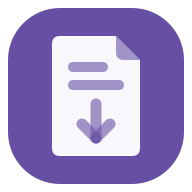
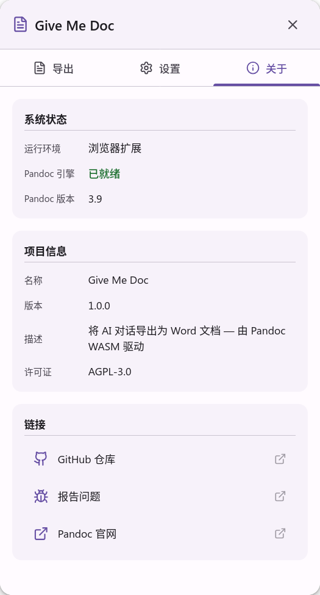

<h1 align='center'>GiveMeDoc</h1>

<a href="README.zh-CN.md">中文</a>

<b>🚫 Stop paying</b> for <b>your own</b> conversations.

An AI conversation export tool based on <b><em>⚡️Pandoc WASM⚡️</em></b> for all platforms.

|  |  |  |  |
| ----- | ---- | ---- | ---- |

## 🤔 Why GiveMeDoc?

I've had enough of those garbage plugins that just wrap Pandoc in a paywall, and dare to charge subscription fees. GiveMeDoc is here to break the mold and provide a truly free, open-source solution for exporting your AI conversations without any hidden costs.

- **Free**: Always free, no paywalls of any kind.

- **No backend**: Pure client-side WASM conversion, your privacy stays local. All processing happens in your browser, no data is sent to any server.

- **Truly open source**: AGPL-3.0 license, welcome any hardcore players to PR.

## ⚡️ Core Tech

- **Anything to Document**: Leveraging Pandoc's dimensionality reduction strike for truly high-quality conversion.

- **Native Formula**: No more image formulas, export Word's native OMML formulas.

## 🚀 Get Started

<!-- Plugin in Chrome/Edge/Firefox Store, Tampormonkey and etc. -->

## License

GiveMeDoc is licensed under the AGPL-3.0 License. See the [LICENSE](LICENSE) file for more details.

## Contributing

Contributions are welcome! Please feel free to submit issues and pull requests.
